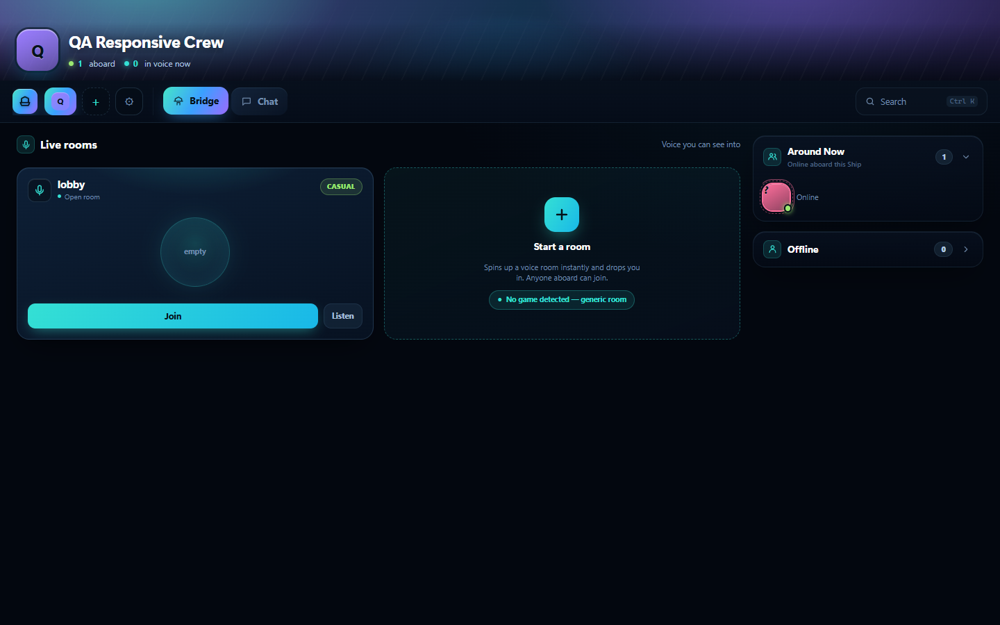
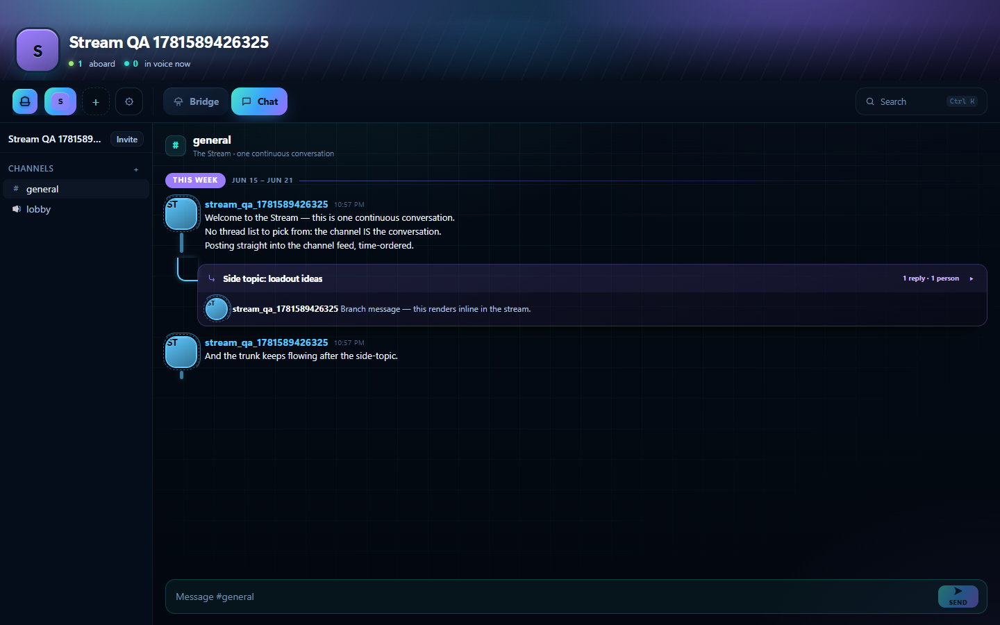
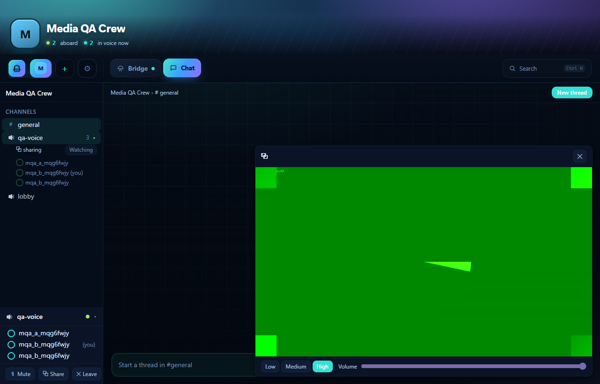

# Shipfall

### A lightweight, self-hosted voice / video / chat for gamers. Get into games with your crew, not lost in channels.

---

> ### ⚠️ Early Access
> Shipfall is **actively in development** — expect rough edges. Known issues we're fixing right now:
> - **Screen-capture conflicts** when another app (e.g. Discord) is also capturing your screen.
> - **Voice room re-entry** occasionally hiccups when rejoining a room.
>
> These are being actively worked on. Your feedback during Early Access genuinely shapes the build.

---

## ⬇ Download

### **[⬇ Download Shipfall for Windows](../../releases/latest)**

Grabs the newest installer from the **[latest release](../../releases/latest)** → `Shipfall-Setup-0.1.0.exe`.

> Prefer the direct link? Open [Releases](../../releases/latest) and download **`Shipfall-Setup-0.1.0.exe`** (~104 MB).
> Per-user install, **no admin required**.

**Requirements:** Windows 10 / 11 (64-bit).

---

## What is Shipfall?

Most chat apps make you *manage channels* before you can *play with friends*. Shipfall flips that. You open a server, see who's around, and jump straight into voice — the games come first, the plumbing stays out of the way. Run it on your own server, invite your crew with a code, and you're in.

---

## Features

### 🛰 Play-first Bridge
Your home view isn't a wall of channels — it's the **Bridge**. Open a server and instantly see who's around and what they're doing, then jump into voice with one move. It's built so the first thing you do is *play*, not *navigate*.

### 🎙 Dynamic voice rooms
Spin up a voice room **instantly** — no setup, no pre-made channel list to maintain. Rooms are **auto-labeled by the game** you're in, and they're **rooms you can look into**: glance at who's in a room and what's happening before you commit to joining.

### 💬 The Stream
Each channel is **one continuous, time-ordered conversation** — no thread-hunting, no scattered replies to dig through. When a side-topic comes up, it **branches inline** so the tangent stays attached to where it started, and the main flow keeps reading top to bottom.

### 🔊 Voice + screen sharing
Low-latency voice with **selectable quality**, plus screen sharing with **cross-channel spectating** — you can watch someone's stream **without joining their voice channel**, each viewer at their own quality. Perfect for peeking at a teammate's run without piling into the call.

### 🔒 Privacy + self-hosted
**Run your own server** — at home or in the cloud. Members **never see each other's IPs** because the server relays all media. And there's **no email required** to sign up. Your crew, your hardware, your rules.

### 🪶 Lightweight + distinctive
A **smaller footprint than Discord** and a **bold, sci-fi-inspired UI** that actually feels like its own thing. Fast to launch, easy on resources, distinctive to use.

### 🔑 Invite-based
Join a server with an **invite code or link**. No public directory, no noise — just the people you invited.

---

## Install

1. **Run the installer** (`Shipfall-Setup-0.1.0.exe`). It installs **per-user — no admin needed**.
2. **Windows SmartScreen** may warn *"Windows protected your PC / unknown publisher"* — this build **isn't code-signed yet**. Click **More info → Run anyway**.
3. Your **antivirus may flag it** as a false positive. This is the **global push-to-talk key hook** the app uses, not malware. If it quarantines the file, **add an exception** or restore it.
4. Open Shipfall, **register**, and **join with the invite code your host gave you**. The client is **pre-configured to connect to your host's server** — there's no address to type.

---

## How it works in 30 seconds

1. **Get an invite** code or link from whoever is hosting your server.
2. **Install & register** — no email needed.
3. **Join** with the code — you're dropped onto the Bridge.
4. **See who's around** and hop into a voice room, or spin up a fresh one.
5. **Share your screen**, or quietly **spectate** a teammate's stream from another channel.

---

## FAQ

**Do I need to run a server to use Shipfall?**
No — if a friend is hosting, just install the client and join with their invite code. The client is pre-configured to their server.

**Is it free?**
Yes. Shipfall is self-hosted and free to use during Early Access.

**Why does my antivirus flag the installer?**
It's a false positive triggered by the **global push-to-talk hook** (the app needs to detect your talk key even when it's in the background). Add an exception if needed.

**Is it code-signed?**
Not yet — that's why SmartScreen shows "unknown publisher." Choose **More info → Run anyway**.

---

## License & source

This repository hosts the **Windows installer downloads** only. The Shipfall source code is **private** and is **not** published here.

---

Shipfall — get into games with your crew, not lost in channels.
