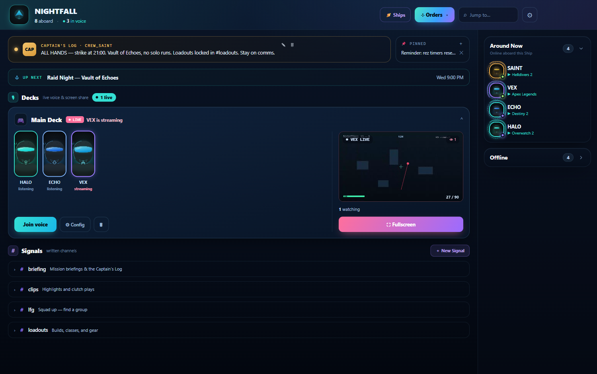
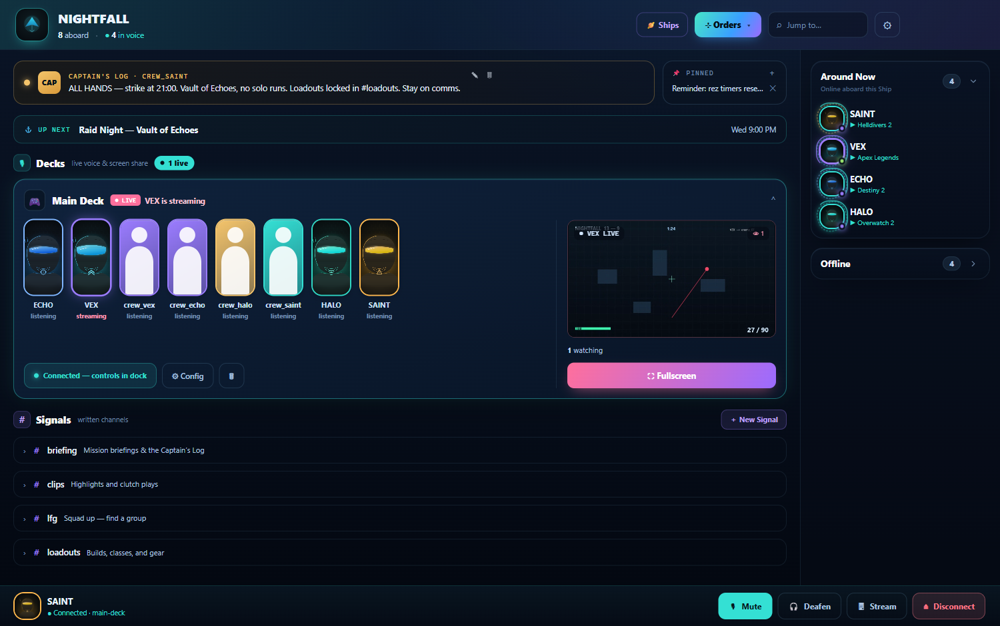
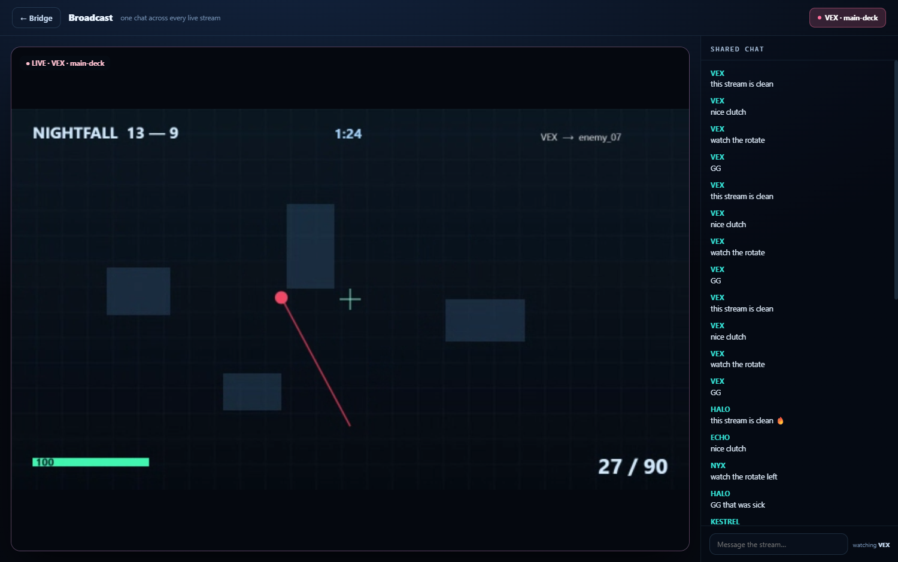
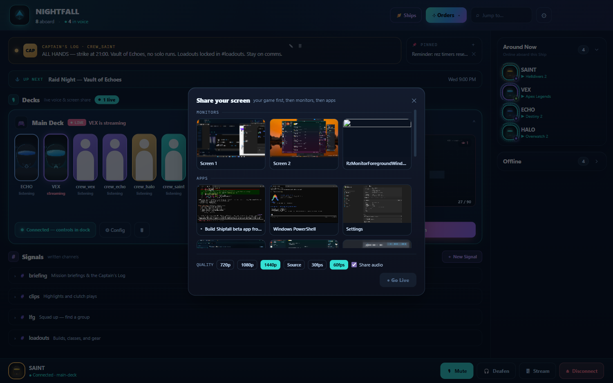
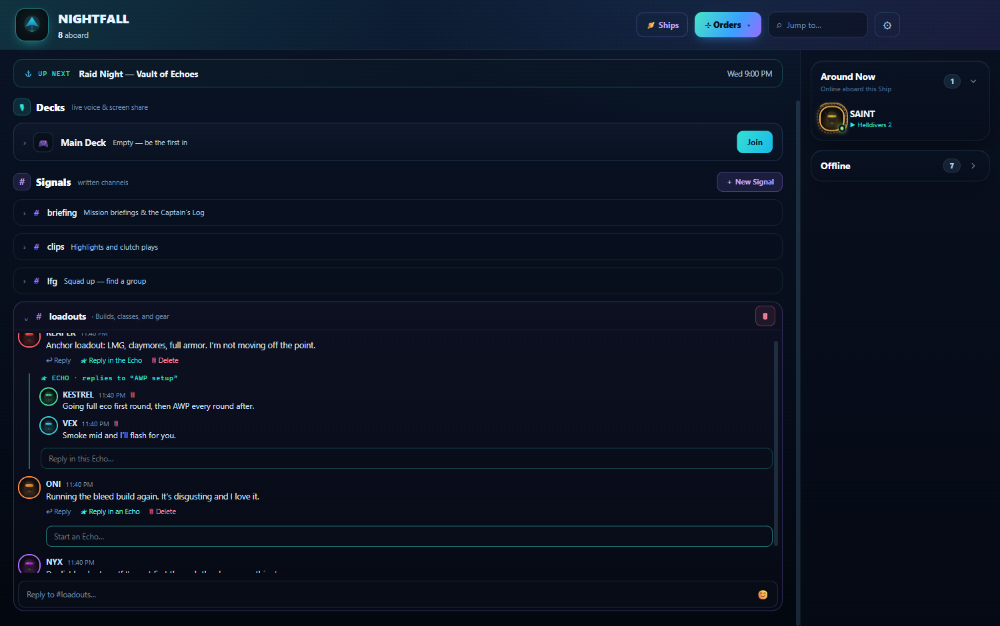
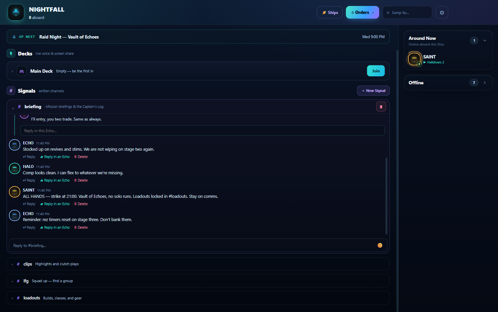
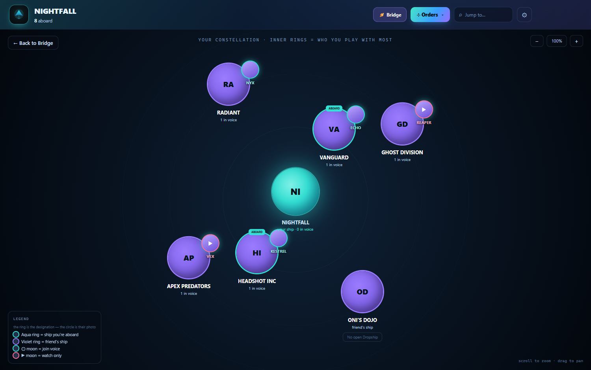
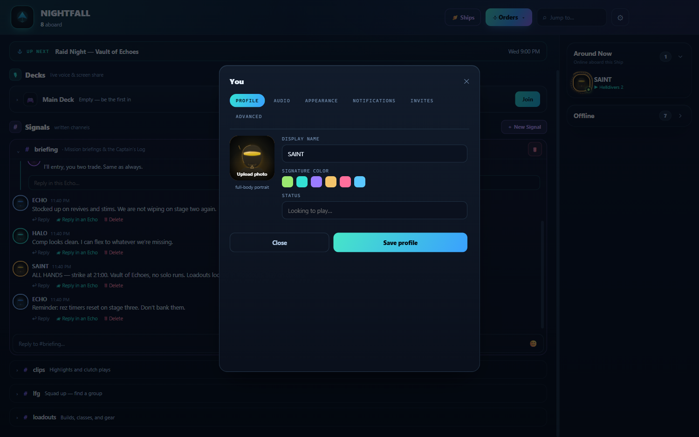
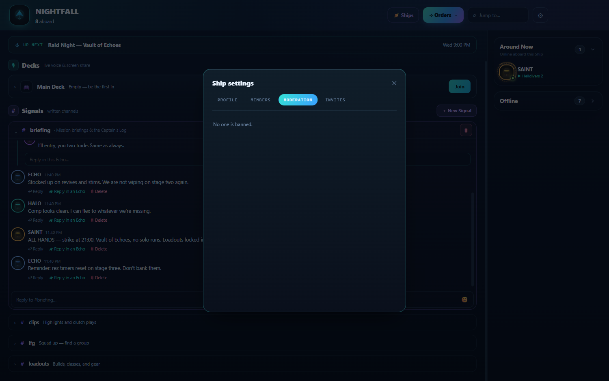
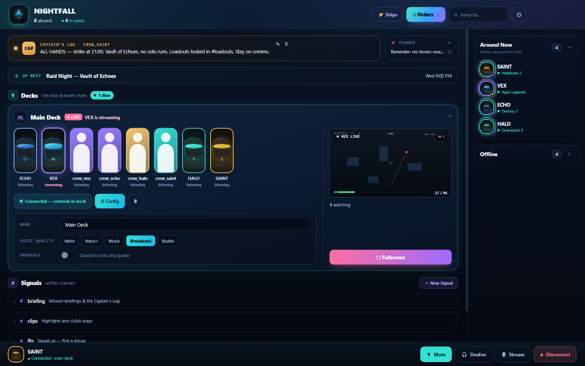

# SHIPFALL

### Voice that feels like a dropship. Chat that branches. A world you can see.

**`EARLY ACCESS`** · Windows Desktop · Zero setup

[**⬇ DOWNLOAD FOR WINDOWS**](https://github.com/ExpLiciTSainT/Shipfall-releases/releases/latest)

No email. No server to run. Download, sign in, you're in.

 

---

Shipfall is a downloadable desktop app for the people you actually play with. We host the
servers, you bring the crew. Hop into a **Deck**, stream your game in **2K60**, branch a
conversation without burying the channel, and watch your whole world light up in real time.

It's voice, video, and chat — built for gamers, with privacy baked into the wire.

> **Heads up — this is Early Access.** Shipfall is in active beta. It's playable and we use it
> every day, but expect rapid updates. The app auto-updates itself from new releases.

| 🎧 **Voice like a dropship** | 🌿 **Chat that branches** | 🪐 **A world you can see** |
|:---:|:---:|:---:|
| Drop into a Deck, see your crew as living portraits, stream your screen inline. | Reply in **Echoes** so side-conversations never bury the channel. | Your Ships and your friends' Ships form a living constellation. |

---

## ⬇ Get Shipfall

The Windows installer is the only Shipfall client.

**[Download `Shipfall-Setup-0.1.0.exe` from the latest release →](https://github.com/ExpLiciTSainT/Shipfall-releases/releases/latest)**

1. **Run the installer.** It's a **per-user install** — no admin rights needed.
2. **If SmartScreen warns you**, click **More info → Run anyway**. (New publisher; the warning fades as reputation builds.)
3. **Sign in.** Pick a handle and a password — **no email required**. That's the whole signup.
4. **You're in.** The app connects to our hosted servers automatically and **auto-updates** from future releases.

No port forwarding. No config files. No "host a server." We run the backend so you never have to.

---

## 🛰️ The Bridge — your Ship's home

A **Ship** is your server. Its crew are **operators**; the owner is the **Captain**, trusted
hands are **officers**. The **Bridge** is where the Ship lives: a **Captain's Log** broadcast
pinned up top, your **Decks** (voice), your **Signals** (text), and the crew who are online
right now — at a glance.

---

## 🎧 Decks — voice that feels like a dropship

A **Deck** is a voice channel, reimagined. Your crew appear as **portrait seats** — not a list,
not gray boxes — and you can **screen-share or stream your game right inside the Deck**. Everyone
else sees a **live preview** and talks over a **shared Deck chat** while they watch. It's a
squad dropping in together, not a conference call.

### Watch the drop, talk over it

Open a stream and the whole Deck leans in — full-bleed preview, shared chat alongside, zero
friction. It's the couch co-op feeling, online.

### Built for 2K60

Pick your source and your quality and go. Shipfall is tuned for **2K at 60fps** so your
gameplay looks like *your* gameplay — crisp, smooth, alive.

### 🛬 Dropship — guest into a friend's Deck

**Dropship** lets you fall into a friend's Deck on **another Ship** as a guest — true
cross-ship voice — whenever they flip the per-Deck toggle. Your buddy's playing on their crew's
Ship? Drop in. No new account, no joining their server.

---

## 🌿 Signals & Echoes — chat that branches

Text channels are **Signals**. When a thread needs its own space, reply in **Echoes** — branching
conversations that keep the main Signal clean. No more scrolling past a 40-message side-quest to
find the thing everyone's actually talking about.

---

## 📡 Captain's Log — say it once, say it loud

The **Captain's Log** is a headline broadcast pinned to the top of the Bridge — raid time, patch
notes, "we're live in 10." Paired with a **Pinned** rail so the important stuff never scrolls away.

---

## 🪐 The Constellation — a world you can see

Your Ships and your friends' Ships orbit together as a **living solar system**. See who's in
voice, who's streaming, where the crew is gathering — *right now*, before you even click in.
Presence isn't a green dot. It's a galaxy.

---

## 🔒 Privacy by design

Most voice apps connect players peer-to-peer, which quietly leaks everyone's IP address to
everyone else. Shipfall doesn't.

- **The server relays all media.** Voice and video flow *through* our backend, so **crew members
  never see each other's IP addresses.** No swatting bait, no "I pulled your IP" — it isn't
  exposed in the first place.
- **No email to sign up.** A handle and a password. That's it. We don't ask for an email because
  we don't want one.

Privacy isn't a settings toggle here. It's how the network is built.

---

## 🪪 Identity — be unmistakable

Every operator gets a **signature color** and an **avatar with subtle motion** — orbit, pulse,
scan, reactor holo-rings. You're recognizable across every Deck and Signal at a glance, never
just another name in a list.

---

## 🛡️ Command your crew

Captains **and** officers keep the Ship in order. Assign roles, **kick**, **ban** (with a full
**unban list**), and **time out** members — a temporary mute with its own **un-timeout list** so
a cooldown is always reversible. Power, with an undo button.

---

## ⚙️ Tune every Deck

Each Deck has its own **config** — dial in voice quality and flip the **Dropship** toggle to
decide whether guests from other Ships can fall in. Per-Deck control, not one-size-fits-all.

---

## ✨ Why it feels different

| | |
|---|---|
| 🎧 **Decks, not channels** | Portrait crew seats + inline streaming. Voice that feels alive. |
| 🎥 **2K60 streaming** | Show your game the way it actually looks. |
| 🛬 **Dropship** | Cross-ship voice — guest into a friend's Deck on any Ship. |
| 🌿 **Echoes** | Branching threaded replies that keep Signals clean. |
| 🪐 **Constellation** | A living map of who's online, in voice, and streaming. |
| 🔒 **IP relay + no email** | Real privacy, on by default. |
| 🖥️ **Frameless desktop** | A seamless app — no clunky OS title bar. |
| ☁️ **Zero setup** | We host it. Download, sign in, play. |

---

## 🧭 The lexicon

| You say | We say |
|---|---|
| Server | **Ship** |
| Members | **Crew / operators** |
| Owner / admin | **Captain / officers** |
| Voice channel | **Deck** |
| Text channel | **Signal** |
| Threaded reply | **Echo** |
| Cross-ship guest voice | **Dropship** |
| Pinned headline | **Captain's Log** |
| Ships overview | **Constellation** |

---

## 🔐 Source code

This is the public **download** repository. Shipfall's source code is private — reach out to the maintainer if you need access.

---

**`EARLY ACCESS`** · Made for the crew you play with.

[**⬇ Download Shipfall →**](https://github.com/ExpLiciTSainT/Shipfall-releases/releases/latest)

